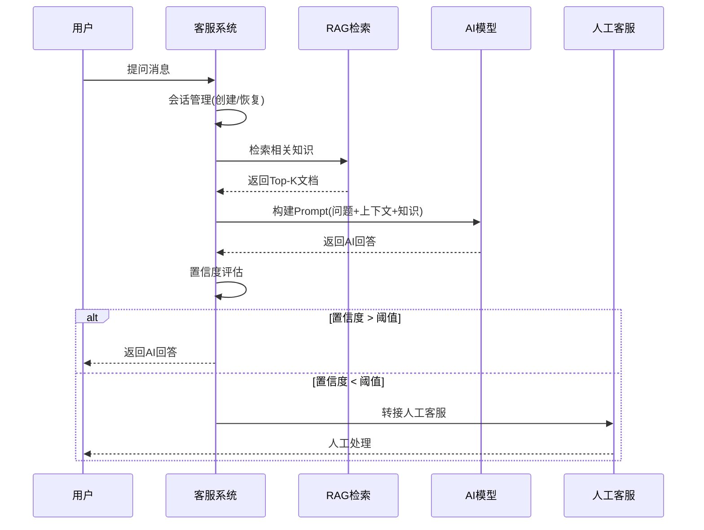
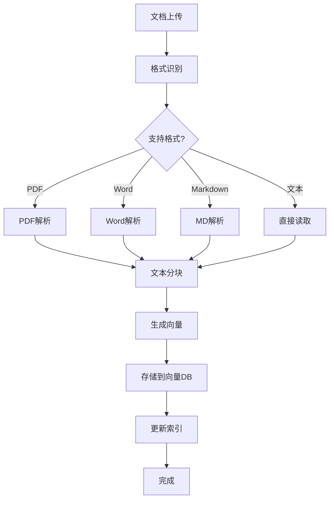

# AideCMS 智能客服系统设计方案

## 📋 目录

- [1. 项目背景](#1-项目背景)
- [2. 现有架构分析](#2-现有架构分析)
- [3. 系统架构设计](#3-系统架构设计)
- [4. 核心功能模块](#4-核心功能模块)
- [5. 技术实现方案](#5-技术实现方案)
- [6. 数据库设计](#6-数据库设计)
- [7. API 接口设计](#7-api-接口设计)
- [8. 前端集成方案](#8-前端集成方案)
- [9. 部署与扩展](#9-部署与扩展)
- [10. 实施计划](#10-实施计划)
- [11. 成本评估](#11-成本评估)
- [12. 风险评估](#12-风险评估)

---

## 1. 项目背景

### 1.1 需求概述

为 AideCMS 项目设计一套完整的智能客服系统，集成 AI 大模型(Eino)知识库能力，实现：

- **智能问答**：基于企业知识库自动回答客户问题
- **多轮对话**：支持上下文保持的多轮对话
- **人工转接**：AI 无法回答时智能转接人工客服
- **知识库管理**：支持文档上传、向量化、检索
- **会话管理**：完整的对话历史和会话跟踪
- **多渠道支持**：Web、微信、小程序等多端接入
- **实时通讯**：WebSocket 支持实时聊天
- **统计分析**：客服效果分析、用户满意度统计

### 1.2 目标用户

- **管理员**：管理知识库、配置客服机器人、查看统计数据
- **客服人员**：处理 AI 无法解决的复杂问题、监控对话质量
- **终端用户**：通过 Web 或小程序获取快速、准确的客服服务

---

## 2. 现有架构分析

### 2.1 已有 AI 能力

AideCMS 已集成 **CloudWeGo Eino** 框架，具备以下能力：

| 能力 | 描述 | 可用性 |
|------|------|---------|
| **多模型支持** | OpenAI, Anthropic, 豆包, 通义千问, ChatGLM 等 | ✅ 已实现 |
| **统一接口** | 统一的 AI 管理器和客户端接口 | ✅ 已实现 |
| **对话管理** | ConversationClient 支持多轮对话和上下文 | ✅ 已实现 |
| **流式响应** | 支持 SSE 流式输出 | ✅ 已实现 |
| **嵌入向量** | 支持文本嵌入生成 | ✅ 已实现 |
| **HTTP 集成** | AIController 提供 RESTful API | ✅ 已实现 |

### 2.2 现有基础设施

| 组件 | 状态 | 说明 |
|--------|--------|------|
| **Hertz 框架** | ✅ | 高性能 HTTP 服务器，支持 WebSocket |
| **GORM ORM** | ✅ | 支持 MySQL/PostgreSQL/SQLite |
| **Redis 集成** | ✅ | 可用于缓存和会话存储 |
| **队列系统** | ✅ | 支持异步任务处理 |
| **用户认证** | ✅ | JWT 认证系统 |
| **Vue 前端** | ✅ | 已有前端框架 |
| **邮件系统** | ✅ | 可用于通知功能 |

### 2.3 需要新增的能力

1. **RAG 检索引擎**：知识库向量化存储和相似度检索
2. **向量数据库**：存储文档嵌入向量（可选使用 pgvector）
3. **文档解析器**：支持 PDF、Word、Markdown 等格式
4. **WebSocket 服务器**：实时双向通讯
5. **客服工作台**：人工客服接入界面

---

## 3. 系统架构设计

### 3.1 整体架构图

```
┌─────────────────────────────────────────────────────────────────────────┐
│                         AideCMS 智能客服系统                           │
└─────────────────────────────────────────────────────────────────────────┘

┌──────────────┐     ┌──────────────┐     ┌──────────────┐
│   客户端层     │     │   网关层      │     │   业务逻辑层   │
├──────────────┤     ├──────────────┤     ├──────────────┤
│ • Web UI      │────▶│ • 路由      │────▶│ • 对话管理    │
│ • 微信小程序   │     │ • 认证      │     │ • 意图识别    │
│ • 移动端      │     │ • 限流      │     │ • RAG 检索    │
│              │     │ • 日志      │     │ • AI 生成      │
└──────────────┘     └──────────────┘     └──────────────┘
       │                   │                    │
       │                   │                    │
       │                   │                    ├──────────────┐
       │                   │                    │              │
       ▼                   ▼                    ▼    ┌─────────▼──────┐
┌──────────────┐     ┌──────────────┐     ┌──────────────┐ │   AI 服务层    │
│  通信层       │     │  数据层       │     │  知识库层    │ ├──────────────┤
├──────────────┤     ├──────────────┤     ├──────────────┤ │• Eino Client │
│ • WebSocket  │     │ • MySQL      │     │• 文档管理    │ │• 多模型      │
│ • HTTP API   │     │ • Redis      │     │• 向量化      │ │• 上下文管理  │
│ • SSE        │     │ • 向量DB     │     │• 检索      │ │• 流式输出    │
└──────────────┘     └──────────────┘     └──────────────┘ └────────────────┘
```

### 3.2 核心流程

#### 3.2.1 用户提问流程



#### 3.2.2 知识库管理流程



### 3.3 技术选型

| 组件 | 技术方案 | 理由 |
|--------|----------|------|
| **AI 框架** | CloudWeGo Eino | 已集成，多模型支持 |
| **对话管理** | Redis + MySQL | Redis 缓存会话，MySQL 持久化 |
| **向量数据库** | pgvector (PostgreSQL) | 开源、成本低、与 GORM 兼容 |
| **文档解析** | pdfcpu, tika | Go 原生，支持多种格式 |
| **文本嵌入** | OpenAI Embedding API | 高质量，已集成 |
| **相似度检索** | 余弦相似度 | 标准方法，性能好 |
| **实时通讯** | Hertz WebSocket | 已有框架支持 |
| **前端框架** | Vue 3 + TDesign | 现有技术栈，一致性 |

---

## 4. 核心功能模块

### 4.1 智能问答引擎

#### 功能描述
- **RAG (Retrieval-Augmented Generation)**：基于知识库检索增强回答
- **上下文管理**：保持多轮对话历史
- **意图识别**：自动识别用户意图
- **置信度评估**：判断 AI 回答的可信度
- **智能路由**：自动分配 AI/人工处理

#### 工作流程

```go
// 伪代码示例
func (s *CSSEngine) ProcessQuestion(ctx context.Context, sessionID, question string) (*Answer, error) {
    // 1. 检索相关知识
    docs := s.rag.Search(ctx, question, 5)
    
    // 2. 加载对话历史
    history := s.session.GetHistory(ctx, sessionID, 5)
    
    // 3. 构建Prompt
    prompt := s.buildPrompt(question, docs, history)
    
    // 4. AI 生成
    answer, err := s.ai.Chat(ctx, prompt)
    if err != nil {
        return nil, err
    }
    
    // 5. 置信度评估
    confidence := s.evaluateConfidence(answer, docs)
    
    if confidence < 0.7 {
        // 转人工
        return s.transferToHuman(sessionID, question)
    }
    
    // 6. 保存会话
    s.session.SaveMessage(ctx, sessionID, question, answer)
    
    return answer, nil
}
```

### 4.2 知识库管理系统

#### 功能列表

| 功能 | 描述 | 优先级 |
|------|------|--------|
| **文档上传** | 支持拖拽上传，批量导入 | P0 |
| **格式支持** | PDF、Word、Markdown、TXT | P0 |
| **自动解析** | 提取文本、分块 | P0 |
| **向量化** | 自动生成嵌入向量 | P0 |
| **索引管理** | 全文索引 + 向量索引 | P0 |
| **版本控制** | 文档版本追踪 | P1 |
| **分类标签** | 支持分类、标签管理 | P1 |
| **全文搜索** | 基于关键词的搜索 | P1 |
| **预览编辑** | 在线预览和编辑 | P2 |

#### 向量化策略

```go
type DocumentChunk struct {
    ID          string    `gorm:"primaryKey"`
    DocumentID  string    // 所属文档ID
    Content     string    // 分块内容
    Vector      []float32 // 嵌入向量 (1536维)
    Order       int       // 分块顺序
    TokenCount  int       // Token 数量
    CreatedAt   time.Time
}

// 向量化流程
func (s *KBService) VectorizeDocument(doc *Document) error {
    // 1. 文本分块 (按 token 或段落)
    chunks := s.chunkDocument(doc.Content, 512, 50) // maxTokens, overlap
    
    // 2. 生成向量
    for _, chunk := range chunks {
        vector, err := s.embedding.Embed(ctx, chunk.Text)
        if err != nil {
            return err
        }
        
        // 3. 存储到向量数据库
        s.vectorDB.Store(&DocumentChunk{
            Content: chunk.Text,
            Vector:  vector,
            // ...
        })
    }
    
    return nil
}
```

### 4.3 对话管理系统

#### 核心功能

- **会话创建**：为每个用户创建独立会话
- **消息存储**：存储用户和 AI 的所有消息
- **上下文管理**：自动维护对话上下文
- **会话恢复**：用户重新连接时恢复历史
- **超时处理**：会话超时自动清理
- **会话统计**：响应时间、满意度等指标

#### 会话数据结构

```go
type Session struct {
    ID           string    `gorm:"primaryKey"`
    UserID       uint64    // 用户ID (游客/注册用户)
    Channel      string    // 接入渠道
    ChannelID    string    // 渠道内唯一ID (如微信openid)
    Status       string    // active, transferred, closed
    AssignedTo   *uint64   // 分配的客服ID (人工)
    Confidence   float32   // 当前置信度
    MessageCount int       // 消息数量
    LastActiveAt time.Time
    CreatedAt    time.Time
    UpdatedAt    time.Time
}

type Message struct {
    ID        string    `gorm:"primaryKey"`
    SessionID string    // 会话ID
    Role      string    // user, assistant, system
    Content   string    // 消息内容
    Metadata  string    // JSON元数据
    Tokens    int       // Token使用量
    Duration  int       // 响应时长(ms)
    CreatedAt time.Time
}
```

### 4.4 人工客服转接

#### 转接触发条件

1. **置信度低**：AI 回答置信度 < 0.6
2. **用户请求**：用户明确要求人工服务
3. **失败重试**：连续 3 次 AI 失败
4. **关键词触发**：包含"投诉"、"退款"等敏感词
5. **超时未响应**：AI 30 秒内未生成有效回答

#### 转接流程

```go
func (s *CSSEngine) transferToHuman(ctx context.Context, session *Session, reason string) error {
    // 1. 更新会话状态
    session.Status = "transferred"
    session.AssignedTo = s.findAvailableAgent()
    session.TransferReason = reason
    
    // 2. 通知客服人员
    event := &TransferEvent{
        SessionID: session.ID,
        From:      "ai",
        To:        *session.AssignedTo,
        Reason:    reason,
        History:   s.session.GetMessages(session.ID),
    }
    s.event.Publish("agent.transfer", event)
    
    // 3. 通知用户
    s.notifyUser(session.ChannelID, "已为您转接人工客服，请稍候...")
    
    return nil
}
```

### 4.5 统计分析系统

#### 统计指标

| 类别 | 指标 | 说明 |
|--------|------|------|
| **对话统计** | 总对话数、平均时长、解决率 | 衡量客服效率 |
| **AI 统计** | AI 回答率、转接率、置信度 | 评估 AI 效果 |
| **满意度** | 用户评分、好评率 | 用户体验指标 |
| **知识库** | 文档数量、检索命中率 | 知识库质量 |
| **客服绩效** | 处理数、响应时间、评分 | 客服人员绩效 |

---

## 5. 技术实现方案

### 5.1 后端技术栈

```
backend/pkg/
├── css/
│   ├── engine.go           # 核心引擎
│   ├── conversation.go     # 对话管理
│   ├── rag/
│   │   ├── retriever.go      # RAG 检索器
│   │   ├── embedder.go       # 嵌入生成
│   │   └── vector_store.go   # 向量存储
│   ├── kb/
│   │   ├── document.go       # 文档管理
│   │   ├── parser.go        # 文档解析
│   │   ├── chunker.go       # 文本分块
│   │   └── search.go        # 全文搜索
│   ├── agent/
│   │   ├── transfer.go       # 转接管理
│   │   ├── queue.go         # 客服队列
│   │   └── routing.go       # 智能路由
│   └── websocket.go        # WebSocket 处理
├── ai/                   # 已有 AI 模块
└── framework/             # 已有框架
```

### 5.2 前端技术栈

```
web/src/
├── views/
│   └── customer-service/
│       ├── ChatWindow.vue       # 聊天窗口
│       ├── MessageList.vue      # 消息列表
│       ├── InputArea.vue       # 输入区域
│       └── TypingIndicator.vue # 输入中提示
├── components/
│   └── cs/
│       ├── KnowledgeBase.vue   # 知识库管理
│       ├── DocumentUpload.vue  # 文档上传
│       ├── ChatStatistics.vue # 统计面板
│       └── AgentConsole.vue   # 客服工作台
└── api/
    └── css.ts             # 客服 API
```

### 5.3 数据库选型

#### 方案一：PostgreSQL + pgvector (推荐)

**优点**：
- 成熟的向量扩展
- 与 GORM 完美集成
- 支持复杂查询
- 开源免费

**缺点**：
- 需要安装 PostgreSQL

#### 方案二：MySQL + Milvus

**优点**：
- 现有 MySQL 基础设施
- Milvus 性能优异
- 支持分布式部署

**缺点**：
- 架构复杂
- 额外维护成本

**推荐方案**：**PostgreSQL + pgvector**（简洁、低成本）

### 5.4 部署架构

```yaml
version: '3.8'
services:
  aidecms-backend:
    build: ./backend
    ports:
      - "8888:8888"
    environment:
      - DB_TYPE=postgres
      - DB_HOST=postgres
      - REDIS_HOST=redis
      - AI_ENABLED=true
  
  postgres:
    image: pgvector/pgvector:pg16
    ports:
      - "5432:5432"
    volumes:
      - postgres_data:/var/lib/postgresql/data
    environment:
      - POSTGRES_DB=aidecms
      - POSTGRES_USER=admin
      - POSTGRES_PASSWORD=secret
  
  redis:
    image: redis:alpine
    ports:
      - "6379:6379"
    volumes:
      - redis_data:/data
  
  web:
    build: ./web
    ports:
      - "80:80"
    depends_on:
      - aidecms-backend

volumes:
  postgres_data:
  redis_data:
```

---

## 6. 数据库设计

### 6.1 核心表结构

#### sessions (会话表)

```sql
CREATE TABLE css_sessions (
    id VARCHAR(36) PRIMARY KEY,
    user_id BIGINT UNSIGNED,
    channel VARCHAR(50) NOT NULL,              -- web, wechat, miniprogram
    channel_id VARCHAR(100),
    status ENUM('active', 'transferred', 'closed') DEFAULT 'active',
    assigned_to BIGINT UNSIGNED,
    confidence FLOAT DEFAULT 0.8,
    message_count INT DEFAULT 0,
    last_active_at TIMESTAMP,
    transfer_reason VARCHAR(255),
    metadata JSON,
    created_at TIMESTAMP DEFAULT CURRENT_TIMESTAMP,
    updated_at TIMESTAMP DEFAULT CURRENT_TIMESTAMP ON UPDATE CURRENT_TIMESTAMP,
    
    INDEX idx_user (user_id),
    INDEX idx_channel (channel, channel_id),
    INDEX idx_status (status),
    INDEX idx_active (status, last_active_at)
) ENGINE=InnoDB DEFAULT CHARSET=utf8mb4;
```

#### messages (消息表)

```sql
CREATE TABLE css_messages (
    id VARCHAR(36) PRIMARY KEY,
    session_id VARCHAR(36) NOT NULL,
    role ENUM('user', 'assistant', 'system', 'agent') NOT NULL,
    content TEXT NOT NULL,
    tokens INT DEFAULT 0,
    duration INT,                                   -- 响应时长(ms)
    confidence FLOAT,                                -- AI置信度
    document_refs JSON,                               -- 引用的知识库文档
    metadata JSON,
    created_at TIMESTAMP DEFAULT CURRENT_TIMESTAMP,
    
    INDEX idx_session (session_id, created_at),
    INDEX idx_role (role),
    
    FOREIGN KEY (session_id) REFERENCES css_sessions(id) ON DELETE CASCADE
) ENGINE=InnoDB DEFAULT CHARSET=utf8mb4;
```

#### kb_documents (知识库文档表)

```sql
CREATE TABLE kb_documents (
    id VARCHAR(36) PRIMARY KEY,
    title VARCHAR(255) NOT NULL,
    category VARCHAR(100),
    tags JSON,                                     -- ['产品', '售后', 'FAQ']
    content TEXT NOT NULL,
    file_url VARCHAR(500),
    file_type VARCHAR(50),
    file_size BIGINT,
    chunk_count INT DEFAULT 0,
    status ENUM('processing', 'indexed', 'error') DEFAULT 'processing',
    version INT DEFAULT 1,
    created_by BIGINT UNSIGNED,
    created_at TIMESTAMP DEFAULT CURRENT_TIMESTAMP,
    updated_at TIMESTAMP DEFAULT CURRENT_TIMESTAMP ON UPDATE CURRENT_TIMESTAMP,
    
    FULLTEXT INDEX ft_content (title, content),
    INDEX idx_category (category),
    INDEX idx_status (status)
) ENGINE=InnoDB DEFAULT CHARSET=utf8mb4;
```

#### kb_chunks (文档分块表)

```sql
CREATE TABLE kb_chunks (
    id VARCHAR(36) PRIMARY KEY,
    document_id VARCHAR(36) NOT NULL,
    chunk_order INT NOT NULL,
    content TEXT NOT NULL,
    vector VECTOR(1536),                              -- pgvector 类型
    token_count INT DEFAULT 0,
    metadata JSON,
    created_at TIMESTAMP DEFAULT CURRENT_TIMESTAMP,
    
    INDEX idx_document (document_id, chunk_order),
    
    FOREIGN KEY (document_id) REFERENCES kb_documents(id) ON DELETE CASCADE
);
```

#### cs_agents (客服人员表)

```sql
CREATE TABLE cs_agents (
    id BIGINT UNSIGNED PRIMARY KEY AUTO_INCREMENT,
    user_id BIGINT UNSIGNED UNIQUE,
    nickname VARCHAR(100),
    avatar VARCHAR(500),
    status ENUM('online', 'busy', 'offline') DEFAULT 'offline',
    max_concurrent INT DEFAULT 5,
    current_sessions INT DEFAULT 0,
    stats JSON,                                      -- 会话统计
    created_at TIMESTAMP DEFAULT CURRENT_TIMESTAMP,
    updated_at TIMESTAMP DEFAULT CURRENT_TIMESTAMP ON UPDATE CURRENT_TIMESTAMP,
    
    INDEX idx_status (status)
) ENGINE=InnoDB DEFAULT CHARSET=utf8mb4;
```

#### cs_transfers (转接记录表)

```sql
CREATE TABLE cs_transfers (
    id BIGINT UNSIGNED PRIMARY KEY AUTO_INCREMENT,
    session_id VARCHAR(36) NOT NULL,
    from_type ENUM('ai', 'agent') NOT NULL,
    from_id VARCHAR(100),
    to_type ENUM('agent', 'queue') NOT NULL,
    to_id VARCHAR(100),
    reason VARCHAR(255),
    transferred_at TIMESTAMP DEFAULT CURRENT_TIMESTAMP,
    
    INDEX idx_session (session_id),
    INDEX idx_transferred (transferred_at)
) ENGINE=InnoDB DEFAULT CHARSET=utf8mb4;
```

### 6.2 索引策略

- **向量索引**：pgvector 的 IVFFlat 或 HNSW 索引
- **全文搜索**：MySQL FULLTEXT 或 PostgreSQL GIN 索引
- **会话查询**：复合索引 (status, last_active_at)
- **消息排序**：复合索引 (session_id, created_at)

---

## 7. API 接口设计

### 7.1 客服 API

#### WebSocket 连接

```typescript
// WebSocket 消息协议
interface CSMessage {
  type: 'connect' | 'message' | 'typing' | 'transfer' | 'close';
  data: any;
}

// 客户端连接
ws://localhost:8888/api/css/ws?channel=web&token=xxx

// 消息示例
{
  "type": "message",
  "data": {
    "session_id": "uuid",
    "content": "如何使用产品A?",
    "timestamp": 1234567890
  }
}
```

#### RESTful API

| 端点 | 方法 | 功能 | 认证 |
|--------|------|------|
| `/api/css/sessions` | POST | 创建会话 | 可选 |
| `/api/css/sessions/:id/messages` | GET | 获取消息历史 | 可选 |
| `/api/css/sessions/:id` | DELETE | 关闭会话 | 可选 |
| `/api/css/knowledge/search` | POST | 搜索知识库 | 是 |
| `/api/css/feedback` | POST | 提交满意度 | 可选 |

### 7.2 管理端 API

| 端点 | 方法 | 功能 | 认证 |
|--------|------|------|
| `/api/admin/css/documents` | POST | 上传文档 | 是 |
| `/api/admin/css/documents/:id` | DELETE | 删除文档 | 是 |
| `/api/admin/css/documents/:id` | PUT | 更新文档 | 是 |
| `/api/admin/css/documents` | GET | 文档列表 | 是 |
| `/api/admin/css/reindex` | POST | 重建索引 | 是 |
| `/api/admin/css/agents` | GET | 客服列表 | 是 |
| `/api/admin/css/stats` | GET | 统计数据 | 是 |
| `/api/admin/css/sessions` | GET | 会话监控 | 是 |
| `/api/admin/css/sessions/:id/assign` | POST | 手动分配 | 是 |

### 7.3 API 响应格式

```typescript
// 统一响应格式
interface ApiResponse<T> {
  success: boolean;
  message?: string;
  data?: T;
  error?: {
    code: string;
    message: string;
    details?: any;
  };
}

// AI 回答响应
interface AIAnswer {
  answer: string;
  confidence: number;
  sources: {
    document_id: string;
    title: string;
    relevance: number;
    snippet: string;
  }[];
  suggested_actions?: string[];
}
```

---

## 8. 前端集成方案

### 8.1 客户端组件

#### ChatWindow.vue (聊天窗口)

```vue
<template>
  <div class="chat-window">
    <MessageList :messages="messages" />
    <TypingIndicator v-if="isTyping" />
    <InputArea @send="handleSend" />
  </div>
</template>

<script setup lang="ts">
import { ref, onMounted } from 'vue';
import { useCSSWebSocket } from '@/composables/useCSSWebSocket';

const { messages, isTyping, sendMessage } = useCSSWebSocket();

const handleSend = (content: string) => {
  sendMessage(content);
};
</script>
```

#### useCSSWebSocket.ts (WebSocket 组合式函数)

```typescript
import { ref } from 'vue';

export function useCSSWebSocket() {
  const messages = ref<CSSMessage[]>([]);
  const isTyping = ref(false);
  const isConnected = ref(false);
  
  let ws: WebSocket | null = null;
  
  const connect = () => {
    ws = new WebSocket(`ws://localhost:8888/api/css/ws`);
    
    ws.onopen = () => {
      isConnected.value = true;
    };
    
    ws.onmessage = (event) => {
      const msg = JSON.parse(event.data);
      handleMessage(msg);
    };
  };
  
  const sendMessage = (content: string) => {
    ws.send(JSON.stringify({
      type: 'message',
      data: { content }
    }));
  };
  
  return { messages, isTyping, sendMessage, connect };
}
```

### 8.2 管理端组件

#### KnowledgeBase.vue (知识库管理)

```vue
<template>
  <div class="kb-manager">
    <DocumentUpload @uploaded="refreshList" />
    <DocumentList :documents="documents" />
    <VectorizationProgress :progress="vectorizationProgress" />
  </div>
</template>

<script setup lang="ts">
import { ref, onMounted } from 'vue';
import { cssAPI } from '@/api/css';

const documents = ref<KBDocument[]>([]);
const vectorizationProgress = ref(0);

const refreshList = async () => {
  documents.value = await cssAPI.getDocuments();
};
</script>
```

#### AgentConsole.vue (客服工作台)

```vue
<template>
  <div class="agent-console">
    <SessionQueue :sessions="queue" @assign="handleAssign" />
    <ActiveSession v-if="activeSession" :session="activeSession" />
    <QuickReplies :replies="quickReplies" />
  </div>
</template>

<script setup lang="ts">
const activeSession = ref<Session | null>(null);
const queue = ref<Session[]>([]);

const handleAssign = (sessionId: string) => {
  // 加入会话
};
</script>
```

---

## 9. 部署与扩展

### 9.1 单机部署

```
适用场景：小型企业，日活 < 1000

架构：
- 1个应用服务器
- 1个数据库服务器
- 1个Redis服务器

配置：
- 4核CPU, 8GB内存
- 100GB SSD
```

### 9.2 分布式部署

```
适用场景：中大型企业，日活 > 1000

架构：
- 2个应用服务器 (负载均衡)
- 1个主数据库 (PostgreSQL)
- 2个从数据库 (读写分离)
- 1个Redis集群
- 1个Nginx负载均衡

配置：
- 每个应用服务器：8核CPU, 16GB内存
- 数据库服务器：16核CPU, 32GB内存
```

### 9.3 扩展性设计

| 组件 | 水平扩展 | 垂直扩展 |
|--------|----------|----------|
| 应用服务器 | ✅ 支持 | ✅ 支持 |
| 数据库 | ✅ 主从复制 | ✅ 增加资源 |
| Redis | ✅ 集群模式 | ✅ 增加资源 |
| 向量检索 | ✅ 分片存储 | ✅ 增加维度 |

---

## 10. 实施计划

### 阶段一：基础功能 (2周)

**目标**：实现核心问答功能

- [ ] 数据库表设计和迁移
- [ ] 基础会话管理
- [ ] 简单问答引擎 (无 RAG)
- [ ] WebSocket 通讯
- [ ] 基础前端界面

**交付物**：
- 可运行的问答系统
- Web 聊天界面

### 阶段二：知识库集成 (1.5周)

**目标**：集成 RAG 能力

- [ ] 文档上传功能
- [ ] 文档解析器 (PDF/Word)
- [ ] 文本分块
- [ ] 向量化生成
- [ ] 向量数据库集成
- [ ] RAG 检索引擎
- [ ] 知识库管理界面

**交付物**：
- 完整的知识库系统
- RAG 问答能力

### 阶段三：人工客服 (1.5周)

**目标**：支持人工转接

- [ ] 客服人员管理
- [ ] 智能转接逻辑
- [ ] 客服工作台
- [ ] 会话分配队列
- [ ] 转接历史记录

**交付物**：
- 人工客服系统
- 混合服务模式

### 阶段四：统计分析 (1周)

**目标**：完善监控和统计

- [ ] 对话统计
- [ ] AI 效果评估
- [ ] 满意度调查
- [ ] 数据可视化
- [ ] 导出报表

**交付物**：
- 统计分析系统
- 数据看板

### 阶段五：多渠道支持 (1周)

**目标**：支持多端接入

- [ ] 微信小程序集成
- [ ] 移动端适配
- [ ] 渠道统一管理
- [ ] 消息路由

**交付物**：
- 多渠道客服系统

---

## 11. 成本评估

### 11.1 开发成本

| 阶段 | 工作量 | 人月 | 成本估算 |
|--------|---------|-------|----------|
| 基础功能 | 2周 | 0.5 | ¥15,000 |
| 知识库集成 | 1.5周 | 0.375 | ¥11,250 |
| 人工客服 | 1.5周 | 0.375 | ¥11,250 |
| 统计分析 | 1周 | 0.25 | ¥7,500 |
| 多渠道支持 | 1周 | 0.25 | ¥7,500 |
| **总计** | **7周** | **1.75人月** | **¥52,500** |

### 11.2 运营成本 (年)

| 项目 | 配置 | 成本/年 |
|------|--------|----------|
| 云服务器 (2台) | 8核16G * 2 | ¥12,000 |
| PostgreSQL 数据库 | 32GB, 1TB存储 | ¥6,000 |
| Redis | 集群 | ¥3,000 |
| 带宽 | 10Mbps | ¥6,000 |
| AI API 调用 | 100万次/月 | ¥24,000 |
| **总计** | | **¥51,000** |

### 11.3 人力成本

| 角色 | 人数 | 薪资/月 | 年成本 |
|------|-------|----------|--------|
| 知识库维护 | 1人 | ¥8,000 | ¥96,000 |
| 客服人员 | 3人 | ¥6,000 | ¥216,000 |
| 技术运维 | 0.5人 | ¥12,000 | ¥72,000 |
| **总计** | | | **¥384,000** |

---

## 12. 风险评估

### 12.1 技术风险

| 风险 | 影响 | 概率 | 应对措施 |
|------|------|------|----------|
| AI 回答质量不稳定 | 高 | 中 | 持续优化 Prompt，人工审核 |
| 向量检索不准确 | 中 | 低 | 调整分块策略，混合检索 |
| 并发性能瓶颈 | 高 | 中 | 使用队列，缓存优化 |
| WebSocket 连接不稳定 | 中 | 低 | 心跳保活，断线重连 |

### 12.2 业务风险

| 风险 | 影响 | 概率 | 应对措施 |
|------|------|------|----------|
| 知识库更新不及时 | 高 | 高 | 自动化导入，定期审核 |
| 客服人员不足 | 中 | 中 | 灵活调配，外包备用 |
| 用户满意度下降 | 高 | 中 | 人工质检，快速反馈 |
| 数据隐私泄露 | 高 | 低 | 加密存储，权限控制 |

### 12.3 合规风险

| 风险 | 应对措施 |
|------|----------|
| 数据安全 | SSL 加密，数据脱敏 |
| 内容合规 | 敏感词过滤，人工审核 |
| 隐私保护 | 遵守 GDPR，用户授权 |
| 备案要求 | 按照当地法规备案 |

---

## 13. 总结与建议

### 13.1 方案优势

1. **技术成熟**：基于已验证的 Eino 框架
2. **可扩展性强**：模块化设计，易于扩展
3. **成本可控**：开源技术栈，无额外授权费
4. **快速交付**：7周完成核心功能
5. **易于维护**：统一技术栈，降低复杂度

### 13.2 实施建议

**推荐实施顺序**：

1. **MVP 阶段**（前3周）
   - 实现基础问答和知识库
   - 小范围测试用户
   - 收集反馈优化

2. **完整版阶段**（后4周）
   - 完善人工客服
   - 统计分析功能
   - 多渠道支持

3. **优化阶段**（持续）
   - 性能优化
   - AI 效果提升
   - 用户体验改进

### 13.3 后续扩展方向

- **语音客服**：语音识别 + TTS
- **视频客服**：实时视频通话
- **智能路由**：基于用户画像的智能分配
- **知识图谱**：构建领域知识图谱
- **多语言支持**：国际化能力
- **API 开放**：第三方接入能力

---

## 附录

### A. 技术术语表

| 术语 | 解释 |
|------|------|
| **RAG** | Retrieval-Augmented Generation，检索增强生成 |
| **Embedding** | 文本向量化，将文本转换为数值向量 |
| **Vector Database** | 向量数据库，用于相似度检索 |
| **Cosine Similarity** | 余弦相似度，衡量向量相似性 |
| **WebSocket** | 全双工通讯协议，支持实时聊天 |

### B. 参考资料

- [CloudWeGo Eino 文档](https://github.com/cloudwego/eino)
- [pgvector 扩展](https://github.com/pgvector/pgvector)
- [向量检索最佳实践](https://www.pinecone.io/learn)
- [智能客服系统设计](https://arxiv.org/abs/2308.01803)

---

**文档版本**: v1.0  
**创建日期**: 2025-02-07  
**更新日期**: 2025-02-07  
**作者**: AideCMS 技术团队
